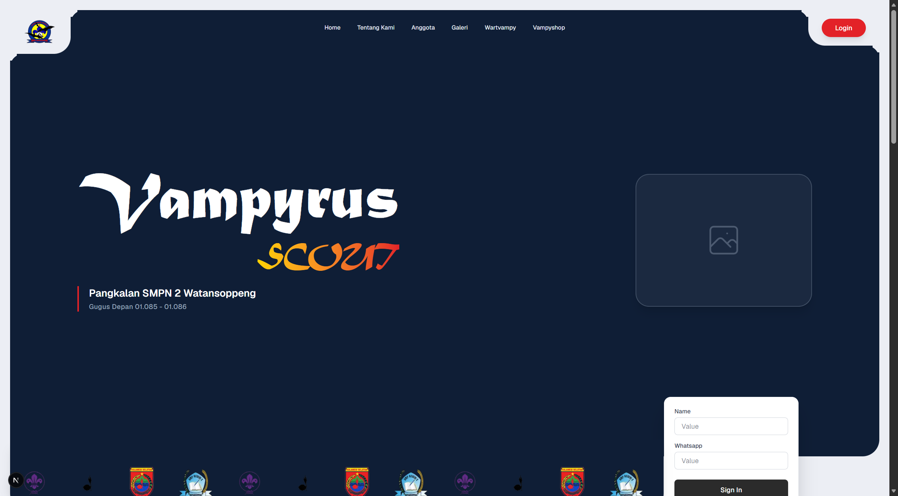

# 🏕️ Vampyrus Scout — Website Profil Gugus Pramuka


## Daftar Isi
- [Deskripsi Proyek](#deskripsi-proyek)
- [Fitur Utama](#fitur-utama)
- [Tech Stack](#tech-stack)
- [Struktur Proyek](#struktur-proyek)
- [Instalasi](#instalasi)
- [Cara Menjalankan](#cara-menjalankan)
- [Kontribusi](#kontribusi)
- [Lisensi](#lisensi)
- [Pengembang](#pengembang)

## Landing Page


## Deskripsi Proyek
**Vampyrus Scout** adalah website profil resmi untuk gugus Pramuka **Vampyrus**. Website ini dibangun untuk memperkenalkan identitas, visi & misi, serta susunan anggota gugus kepada publik secara digital, modern, dan mudah diakses.

Proyek ini dikembangkan menggunakan **Next.js** dengan **TypeScript**, mengedepankan tampilan yang responsif dan performa loading yang cepat.

## Fitur Utama
- **Hero Section** — Tampilan utama yang menampilkan identitas visual gugus Vampyrus Scout.
- **Visi & Misi** — Halaman yang menjelaskan visi, misi, dan nilai-nilai kepramukaan yang dijunjung.
- **Profil Anggota** — Menampilkan susunan dan profil anggota/pengurus gugus.
- **Identitas Kelembagaan** — Menampilkan logo resmi afiliasi organisasi seperti **WOSM**, **Kwarda**, dan sekolah pangkalan (**SMP 2**).
- **Desain Responsif** — Tampilan optimal di berbagai perangkat, dari desktop hingga mobile.

## Tech Stack
| Komponen | Teknologi |
|---|---|
| Framework | Next.js (App Router) |
| Bahasa | TypeScript |
| Styling | Tailwind CSS |
| Font Kustom | MATURASC (custom typeface) |

## Struktur Proyek
```text
├── app/
│   ├── globals.css        # Styling global
│   ├── layout.tsx         # Layout utama aplikasi
│   └── page.tsx           # Halaman utama (landing page)
├── components/
│   ├── Header.tsx          # Navigasi utama website
│   ├── HeroSection.tsx     # Bagian hero/banner utama
│   ├── VisiMisi.tsx        # Komponen visi & misi
│   └── Anggota.tsx         # Komponen daftar anggota
├── public/
│   ├── Logo.webp
│   ├── Kwarda.webp
│   ├── Wosm.webp
│   ├── Tunas.webp
│   ├── Smp2.webp
│   └── fonts/
│       └── MATURASC.TTF
├── next.config.ts
└── package.json
```

## Instalasi

### Prasyarat
- Node.js `>= 18.x`
- npm atau package manager lain (yarn/pnpm)
- Git

### Clone Repository
```bash
git clone https://github.com/alviansyahburhani/Profile-Vampyrus-Scout.git
cd Profile-Vampyrus-Scout
```

### Instalasi Dependensi
```bash
npm install
```

## Cara Menjalankan

### Mode Pengembangan
```bash
npm run dev
```
Akses website melalui `http://localhost:3000`.

### Build untuk Produksi
```bash
npm run build
npm run start
```

## Kontribusi
Kontribusi terbuka untuk pengembangan lebih lanjut. Silakan ikuti langkah berikut:
1. Fork repository ini
2. Buat branch baru (`git checkout -b fitur/nama-fitur`)
3. Commit perubahan (`git commit -m "Menambahkan fitur X"`)
4. Push ke branch (`git push origin fitur/nama-fitur`)
5. Buat Pull Request

## Lisensi
Proyek ini dilisensikan di bawah [MIT License](LICENSE).

## Pengembang
Proyek ini dikembangkan oleh **Alvian Syah Burhani**.

📧 Untuk pertanyaan atau kolaborasi, silakan hubungi melalui GitHub: [@alviansyahburhani](https://github.com/alviansyahburhani)
